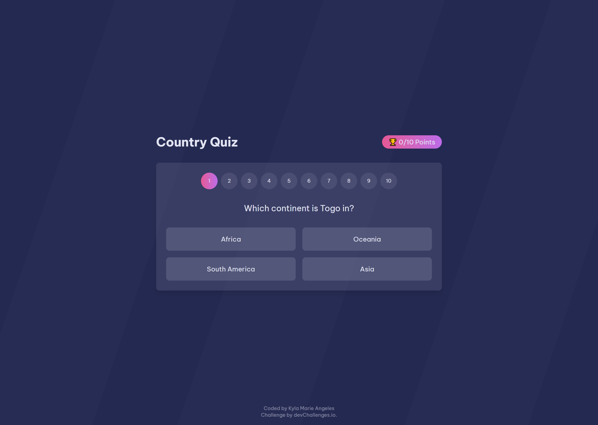

<h1 align="center">Country Quiz | devChallenges</h1>

   Solution for a challenge <a href="https://devchallenges.io/challenge/country-quizz" target="_blank">Country Quiz</a> from <a href="https://devchallenges.io" target="_blank">devChallenges.io</a>.

  <h3>
    <a href="{https://your-demo-link.your-domain}">
      Demo
    </a>
     | 
    <a href="{https://your-url-to-the-solution}">
      Solution
    </a>
     | 
    <a href="https://devchallenges.io/challenge/country-quizz">
      Challenge
    </a>
  </h3>

## Table of Contents

- [Overview](#overview)
  - [What I learned](#what-i-learned)
  - [Useful resources](#useful-resources)
- [Built with](#built-with)
- [Features](#features)
- [Contact](#contact)
- [Acknowledgements](#acknowledgements)

## Overview

This project is a submission to the "Country Quiz" challenge on DevChallenges.io. It's built using **React.js** and **Tailwind CSS**, focusing on building a responsive and interactive quiz app based on countries and flags.

### What I learned

- How to manage component state in React to handle quiz logic
- How to fetch and process data from APIs
- How to improve responsive design using Tailwind CSS

### Useful resources

- [React Docs](https://reactjs.org/docs/getting-started.html)
- [Tailwind CSS Docs](https://tailwindcss.com/docs)

### Built with

- React.js
- Tailwind CSS
- Semantic HTML5 markup
- Flexbox
- Mobile-first responsive design

## Features

- Start quiz
- View quiz results
- Responsive design
- Flag and country-based questions

## Acknowledgements

- Country flags from REST Countries API

## Author

- GitHub [@keilalily](https://github.com/keilalily)
- Website [https://kylamarieangeles.vercel.app/](https://kylamarieangeles.vercel.app/)
